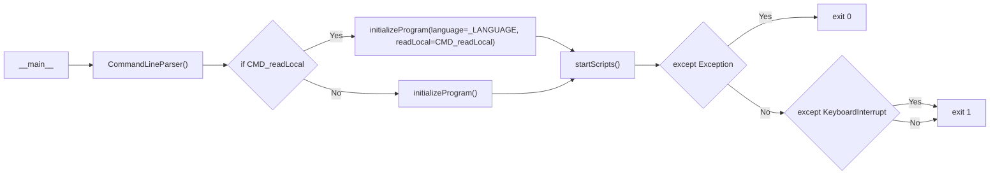

# Source Code Documentation


<!-- Environment -->

## Environment

Please ensure the following libraries are installed; otherwise, run the command to install.

```
pip install psutil
pip install subprocess
pip install logging

pip install argparse

pip install win32api
pip install win32gui
pip install win32con

pip install pyautogui
pip install ImageGrab
```


<!-- m.py -->

# [_m.py_](/m.py)

Work as the main program, calling other modules and scripts to work together.

### Modules Utilized

#### Python Modules:
`os`, `sys`, `time`, `argparse`

#### Local Modules:
`utils.logger`, `utils.screen`, `utils.sysUtils`, `utils.ProgramInfo`

#### Scripts
`ShadowOfTombRaider`, `AvP_D3D11`, `SniperEliteV2`, `BHScripts`, `GenshinImpact`, `Fallout4`, `Office`, `WeHappyFew`, `ApexLegends`, `DMC5`, `Witcher3`, `Skyrim`, `FFXIV2`, `FFXIV3`, `FFXIV4`, `FFXIV3`, `ComputeMark2`

## Structure



## Functions

### `CommandLineParser()`

Parse parameters directly from Command Line and read them as the local variable.

Set Global Variable:
- `CMD_readLocal` - used in `main(): initializeProgram(readLocal=CMD_readLocal)`
- `_LANGUAGE` - used in `main(): initializeProgram(language=_LANGUAGE)`

### `initializeProgram(language=None, readLocal=None)`

Initialize the _global variable_ `PROGRAM` by constructing a [ProgramInfo](/main/ProgramInfo.py) object.

#### Parameter:
1. `language` - Language to be displayed.
2. `readLocal` - `True` to read local settings; otherwise, use inputted preference.

Set Global Variable:
- `PROGRAM` - used in as a ProgramInfo Object to parse all Program information

### `dealWinDumps()`

Move and log Windows' dump files

### `startScripts()`

Get the current game's run list and loop times from `PROGRAM` and call functions to start scripts.


<!-- utils folder -->

# [utils](/utils/)

***Please check detailed specification in the original module file.***

## [_input.py_](/docs/utils/input.md)

A module that implements mouse and keyboard actions in _Windows System_.

## [_keyboardUtils.py_](/docs/utils/keyboardUtils.md)

A module that implements common mouse and keyboard actions. It also contains methods to perform _normal Benchmarking_, _stressed Benchmarking_, and _random Character Controlling_.

## [_logger.py_](/docs/utils/logger.md)

A module that construct and return a [_logging_](https://docs.python.org/3.5/library/logging.html) Object that can be used to debug and log information during runtime.

## [_screen.py_](/docs/utils/screen.md)

A module that can take and save screenshots and also find whether a window is opened in _Windows System_.

## [_sysUtils.py_](/docs/utils/utils.md)

A module that can read and write JSON files, search files, and force to kill a process in _Windows System_.

## [_VK_CODE.py_](/docs/utils/VK_CODE.md)

A class having two dictionaries to represent VK_CODE. Mainly used for [_input.py_](/lib/input.py).


<!-- main folder -->

# [main](/main/)

***Please check detailed specification in the original module file.***

## [_ProgramInfo.py_](/docs/main/ProgramInfo.md)

A class that shows this program interact-able screen and save all the user config settings.

## [main/scripts](/main/scripts/)

Individual automation scripts to be ran.

## [main/tests](/main/tests/)

Testing scripts to be ran.


<!-- resources folder -->

# resources

## [config_settings](/resources/config_settings)

Game's configuration files. Mainly used to change graphic and other in-game settings by directly calling the `.reg` registration files.

## [environments](/resources/environments)

Required system environments that should be installed for developing purpose.

## [keyassist](/resources/tinytask)

Executor Programs of assisting keyboard and mouse actions generated by [***TinyTask***](https://sites.google.com/view/tinytask/)

## [office](/resources/office)

Office documents to be open for Office Automation Testing

## [saves](/docs/main/saves.md)

Game's save files for Benchmarking or other purposes.

## [tl](/docs/main/tl.md)

JSON files for Program's user screen localization


<!-- Localization -->

# Localization

## Chinese
#### [***programText_cn.json***](/resources/tl/programText_cn.json)
A JSON file that perform the Chinese language for the program interact-able screen.

## English
#### [***programText_en.json***](/resources/tl/programText_en.json)
A JSON file that perform the English language for the program interact-able screen.
